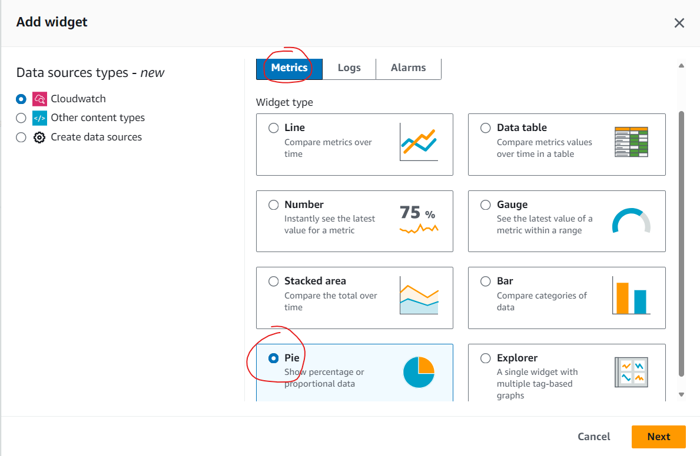

# Prerequisites
- Visual Studio Code
- Linux Environment (Ubuntu 22.04 or 24.04)
- Docker Engine and Docker Compose
- Required to install [dotnet 8 SDKs/Runtime](https://learn.microsoft.com/en-us/dotnet/core/install/linux-ubuntu-install?tabs=dotnet8&pivots=os-linux-ubuntu-2404)
- Able to access AWS Cloud Watch console.
# Scenarios
- Task 1. Setup Projects and Environments
- Task 2. Setup AspnetCore 6 WebApp to send custom metrics, logs to Cloud Watch Metrics and Logs
- Task 3. Instrumentating application with Open Telemetry and Otel Collector.

# Understand the scenarios
## Architecture Diagram
  
  ### Application Code
  
  
  
- 1. The /etc directory will include an [initdb.sh](./etc/initdb.sh) file, which contains the script to initialize the initial values for the PostgreSQL database and also creates VoteDb if it does not already exist. Also, The [otel-config.yaml](./etc/otel-config.yaml) file will be the configuration for the otel-collector.
- 2. This is the main API of the lab, where the basic API methods have been implemented, such as:
      - Load all information of Candidates
      - Create a new Candidate by Name
      - Vote for a specific Candidate by entering CandidateID
      - Delete a Candidate by CandidateID
- 3. After a Candidate is voted for by entering CandidateID, the counter value in the DB will increase by one. However, this increment does not occur in the VotingData API, but in another ServiceWorker that listens for messaging from RabbitMQ and consumes the messages to determine which Candidate's counter needs to be incremented.
- 4. The docker-compose file is used to start all related services and is pre-configured to start up with the VotingData API on port 5000, and the related services include:
      - Voting API
      - ServiceWorker
      - RabbitMQ
      - PostgresDB
  - Additionally, there is a .env file to set the secrets related to AWS credentials. Because this information needs to be kept secure, the default values you see are invalid. You need to input the actual values, which will be provided by the trainer
### Open Telemetry Collector
  - The OpenTelemetry Collector offers a vendor-agnostic implementation of how to receive, process and export telemetry data. It removes the need to run, operate, and maintain multiple agents/collectors. This works with improved scalability and supports open-source observability data formats 
  - The OpenTelemetry project provides two versions of the Collector:
    + Core: Foundational components such as configuration and generally applicable receivers, processors, exporters, and extensions.
    + Contrib: All the components of core plus optional or possibly experimental components. Offers support for popular open-source projects including Jaeger, Prometheus, and Fluent Bit. Also contains more specialized or vendor-specific receivers, processors, exporters, and extensions.
  - While AWS Distro for OpenTelemetry is a secure, open source APIs, libraries, and agents to collect distributed traces and metrics for application monitoring. With AWS Distro for OpenTelemetry, you can instrument your applications just once to send correlated metrics and traces to multiple AWS and Partner monitoring solutions. Use auto-instrumentation agents to collect traces without changing your code
-  This AWS Distro was built on top of OpenTelemetry Collector, and AWS Team is also contributor to OpenTelemetry project as well.
-  The current version of AWS Distro only support for Metric and Traces, but for Logs, the OpenTelemtry Collector contrib had done at greate job

  - This lab we use an Contributor version of Otel Collector (refer this url for more detail https://github.com/open-telemetry/opentelemetry-collector-contrib), which has a lot of exporters for Azure, AWS and others vendor (https://github.com/open-telemetry/opentelemetry-collector-contrib/tree/main/exporter)

# Task 1  Setup Projects and Environments

## Up and Run
- Make sure these services are working properly:
    + Postgresql with pre-define candidate, or we could add more by modify the [initial db script](./etc/initdb.sh)
    + RabbitMQ
    + VoteDB in Postgres
    + Voting API via localhost:5000

- Run docker-compose command to test the initial environment for this lab

  ```bash
    $/home/lab: docker compose up
  ```
- In this lab, we use the postgres docker-entrypoint-initdb.d entry point which will initilize the shell script [initdb.sh](./../etc/initdb.sh) to create schema for VoteDB, the db connection info to Postgresdb as below
  ```
    postgres username : postgres
    postgres password : postgres
    Db Name : VoteDB
  ```
- Open the Swagger UI for Voting API at http://localhost:5000, test to make sure you can perform the query, insert and delete functionalities.

- After this step, all the related services and engine are required for this lab has been up and running well properly. Next, we would implemeting the technique to enable logs,metrics and traces in this application.

## Setup OpenTelemtry Collector and Configure to send telemtry to AWS CloudWatch.

### Add otel-collector into [docker-compose.yml](./docker-compose.yml)
- Add the new yml code into docker-compose, the image for otel collector will be use the contrib version of open telemetry collector.
  
  ```yaml
  otel-collector:    
    image: otel/opentelemetry-collector-contrib:latest    
    command: ["--config=/etc/otel-config.yaml"]
    volumes:        
      - ./etc/otel-config.yaml:/etc/otel-config.yaml
    environment:    
      - AWS_REGION=${AWS_REGION}
      - AWS_ACCESS_KEY_ID=${AWS_ACCESS_KEY_ID}
      - AWS_SECRET_ACCESS_KEY= ${AWS_SECRET_ACCESS_KEY}
    ports:
      - "4317:4317"
    networks:
      - monitoring-network  
  ```
- Replace the AWS Credential information in [.env](.env) file, below is example
  ```
  AWS_REGION=ap-southeast-1
  AWS_ACCESS_KEY_ID=AKIAWYxxxxxxxx66X <--- replace this key
  AWS_SECRET_ACCESS_KEY=cbdKxxxxxxxxxxxxxxoJdsigU <--- replace this key
  ```

# Task 2. Setup AppNetCore WebAPI, and send custom metrics, logs to Cloud Watch
In this section, we would instrumenting the votingdata api sending 3 types of telemtry (logs,metrics and traces) to otel-collector via OTLP protocol on port 4317.
## Enable the VotingData API code to send Logs
### Import the namespace and configuration file into VotingData project
- In VotingData directory (/src/VotingData), use the terminal in Visual Studio Code to install below packages.

  ```xml
    dotnet add package Microsoft.Extensions.Configuration --version 8.0.0
    dotnet add package Microsoft.Extensions.Logging --version 8.0.0
    
    dotnet add package OpenTelemetry.Extensions.Hosting --version 1.8.1

    dotnet add package OpenTelemetry --version 1.8.1
    dotnet add package OpenTelemetry.Exporter.Console --version 1.8.1 

    dotnet add package OpenTelemetry.Exporter.OpenTelemetryProtocol --version 1.8.1
    
  ```
- In VotingData project, open [Program.cs](./src/VotingData/Program.cs) file, add below code to add optentelemtry data into Log provider
  
  + Import the namesapace
    ```c#
    using System.Reflection;
    using OpenTelemetry;
    using OpenTelemetry.Logs;
    using OpenTelemetry.Resources;
    using OpenTelemetry.Metrics;
    ```
  + And then register the TelemetryConfiguration
    
    ```diff
      builder.Logging.ClearProviders();
    + var defaultResource = ResourceBuilder.CreateDefault();
    + builder.Logging.AddOpenTelemetry(options =>
    + {
    +   options.IncludeFormattedMessage = true;
    +   options.ParseStateValues = true;
    +   options.IncludeScopes = true;
    +   options.SetResourceBuilder(defaultResource);
    +   options.AddOtlpExporter();        
    + });
    ```

### Enable the Worker service to send Logs
- For worker project, do the same steps as you have done with VotingData project.
  ```  
  dotnet add package Microsoft.Extensions.Configuration --version 8.0.0
  dotnet add package Microsoft.Extensions.Logging --version 8.0.0
    
  dotnet add package OpenTelemetry.Extensions.Hosting --version 1.8.1

  dotnet add package OpenTelemetry --version 1.8.1
  dotnet add package OpenTelemetry.Exporter.Console --version 1.8.1 

  dotnet add package OpenTelemetry.Exporter.OpenTelemetryProtocol --version 1.8.1

  ```
- The ConfigureLogging section in [Program.cs](./src/worker/../Worker/Program.cs) will look like
  ``` diff
  + using OpenTelemetry;
  + using OpenTelemetry.Logs;
  + using OpenTelemetry.Resources;
  + using OpenTelemetry.Metrics;
  
  + var defaultResource = ResourceBuilder.CreateDefault();
    builder.ConfigureLogging((hostBuilderContext,logging) =>
    {
      logging.ClearProviders();
      logging.AddConsole();

      //add below code block
  +   logging.AddOpenTelemetry((options) =>
  +   {
  +       options.SetResourceBuilder(defaultResource);       
  +       options.AddOtlpExporter();
  +   });
    });
  ```

  
### Add new config block into [otel-config.yaml](./etc/otel-config.yaml) for otlp logs receival and exporter it to aws cloud watch logs
- Open [otel-config.yaml](./etc/otel-config.yaml)
  ``` diff

  receivers:
  + otlp:
  +   protocols:
  +     grpc:  

  processors:
    batch:  

  exporters:
  + awscloudwatchlogs:
  +   region: ap-southeast-1
  +   log_group_name: "{sd####}/o11y-lab/logs"
  +   log_stream_name: "{sd####}/o11y-lab/stream"
  +   log_retention: 7

  service:
    pipelines:    
  +   logs:
  +     receivers: [otlp]
  +     processors: [batch]
  +     exporters: [awscloudwatchlogs] 
  ```
  + You need to provide your sd number into the {sd###} remark, example value **sd0123/o11y-lab/logs** to distinct the log group with other members in this lab
  + **receivers**: configurated value is **otlp**,It will receive the grpc telemetry data by OTLP protocol(port 4317).
  + **processsors**: data would be send via batch
  + **exporters**: We config to use logging exporter and select the destination to logging(console log) and ***awscloudwatchlogs**
  + After configurate the receivers, proccessors and exporters, all of the components need tobe specify into a service pipelines
### Update Environment Attributes in [docker-compose](/docker-compose.yml) file, Navigate to the location of voting-api and queue-worker, and add the two properties OTEL_EXPORTER_OTLP_ENDPOINT and OTEL_SERVICE_NAME.

```diff
  voting-api:
    image: mcr.microsoft.com/dotnet/sdk:8.0
    command: bash -c "dotnet restore && dotnet build && dotnet run  --urls http://+:5000"
    working_dir: /app
    volumes:
      - ./src/VotingData:/app      
    ports:
      - "5000:5000"
    depends_on:
      - rabbitmq  
    networks:
      - monitoring-network
+   environment:
+     - OTEL_EXPORTER_OTLP_ENDPOINT=http://otel-collector:4317
+     - OTEL_SERVICE_NAME=VotingApi

  queue-worker:
    image: mcr.microsoft.com/dotnet/sdk:8.0
    command: bash -c "dotnet restore && dotnet build && dotnet run"
    working_dir: /app
    volumes:
      - ./src/Worker:/app   
    depends_on:
      - rabbitmq 
    networks:
      - monitoring-network
+   environment:
+     - OTEL_EXPORTER_OTLP_ENDPOINT=http://otel-collector:4317
+     - OTEL_SERVICE_NAME=WorkerService
``` 
- The OTEL_EXPORTER_OTLP_ENDPOINT property specifies the address needed for the services to export telemetry data (logs, metrics, traces) to the otel-collector via the OLTP protocol and port 4317
- The OTEL_SERVICE_NAME property will serve as an indicator for service.name, which is a part of the OpenTelemetry specification
### Test the Voting API to see logs on CloudWatch Logs
- Run docker compose by using
  ```
    docker compose up --force-recreate
  ```
- In the new vote submit method, we created a log information with message to write a log entry with the candidate name.

  ```c#
    string.Format("Candidate name {0} has been created",name);
  ```  
- Open the swagger ui at http://localhost:5000 and perform a new vote submition from /submitvote/{name}
- Login Cloud Watch console, open the log group sd_number/o11y-training/logs
  


## Send Custom Metrics to CloudWatch Metrics
### Register OpenTelemetry Metric Provider
- Add the related nuget packages for metrics into VotingData and Worker project
  
  ```xml
    
    dotnet add package OpenTelemetry.Instrumentation.AspNetCore --version 1.8.1
    
  ```
### Register Metric Provider for VotingData project
  - In [Program.cs](./src/VotingData/Program.cs), register Metric Provider as below
  ```diff
  +  builder.Services.AddOpenTelemetry()
  +    .WithMetrics((providerBuilder) => providerBuilder
  +      .AddMeter("VotingMeter")
  +      .SetResourceBuilder(defaultResource)
  +      .AddAspNetCoreInstrumentation()
  +      .AddConsoleExporter()
  +      .AddOtlpExporter()
  +    );

  ```
### Register Metric Provider for Worker project, and check the Configs:ServiceName in appsetting.json
  - Do the same in [Program.cs](./src/Worker/Program.cs) in worker project
  ```diff
    builder.ConfigureServices((hostBuilderContext, services) =>
    {
  +    services.AddOpenTelemetry()            
  +             .WithMetrics((providerBuilder) => providerBuilder
  +             .AddMeter("VotingMeter")
  +             .SetResourceBuilder(defaultResource)
  +             .AddAspNetCoreInstrumentation()
  +             .AddConsoleExporter()
  +             .AddOtlpExporter());
    }
  ```
### Add code into controller to create metric counter

- Implementing the logic to create custom metric in class MessageConsumer.cs in Worker project
    ```diff
      using System.Collections.Generic;
    + using System.Diagnostics;
    + using System.Diagnostics.Metrics;
      using MassTransit;
      using VotingData.Db;
      using Microsoft.EntityFrameworkCore;
      using System.Diagnostics;

      using queue.datacontracts;

      namespace worker.Consumers;

      public class MessageConsumer : IConsumer<Message>
      {
          private readonly ILogger _logger;     
          private readonly VotingDBContext dbContext; 
    +     private Meter meter;
          public MessageConsumer(ILogger<MessageConsumer> logger,VotingDBContext context)
          {
              _logger = logger;
              this.dbContext = context;       
    +         meter = new Meter("VotingMeter","0.0.1");         
          }

          public async Task Consume(ConsumeContext<Message> context)
          {        
              try
                  {
                      var candidate = await dbContext.Counts.FirstOrDefaultAsync(c => c.ID ==context.Message.Id);
                      
                      if (candidate != null)
                      {                    
                          candidate.Count++;
                          dbContext.Entry(candidate).State = EntityState.Modified;                    

                          _logger.LogInformation(String.Format("Candidate name {0} has been increased the counter to {1}",candidate.Candidate,candidate.Count));
    
    +                     var tags = new TagList();
    +                     tags.Add("candidate",candidate.Candidate);            
    +                     var counter = meter.CreateCounter<int>("vote.counter");                
    +                     counter.Add(1,tags);
                         
                          await dbContext.SaveChangesAsync();
                      }

                  }
                  catch (Exception ex) when (ex is DbUpdateException ||
                                            ex is DbUpdateConcurrencyException)
                  {
                      _logger.LogError(ex, "DB Exception Saving to Database");
                  
                  }

                  
              await Task.Delay(TimeSpan.FromMilliseconds(200), context.CancellationToken);
          }
      }
    ```
- Register Metric Exporter in otel-config.yaml
    ```diff
    
    receivers:
      otlp:
        protocols:
          grpc:  

    processors:
      batch:  

    exporters:
      awscloudwatchlogs:
        region: ap-southeast-1
        log_group_name: "{sd####}/o11y-lab/logs"
        log_stream_name: "{sd####}/o11y-lab/stream"
    + awsemf:
    +   region: ap-southeast-1
    +   log_group_name: {sd####}/o11y-lab/metrics
    +   log_retention: 7

    service:
      pipelines:    
        logs:
          receivers: [otlp]
          processors: [batch]
          exporters: [awscloudwatchlogs]   
    +   metrics:
    +     receivers: [otlp]
    +     processors: [batch]
    +     exporters: [awsemf] 
         
    ```
  + You need to provide your sd number into the {sd###} remark, example value **sd0123/votingapi/metrics** to distinct the log group with other members in this lab
  + Run the web application on port [5000](http://localhost:5000), submit a new candiate or perform vote on an candidate id
  + Login AWS Console, Go to all metrics, navigate to the custom metric namespace to see the pushed metric

    
    
### Build Voting Candidate Pie Chart and Add to Dashboard
- We will create a chart to display the number of votes for each candidate, using a query tree, and select the corresponding Pie Chart type
#### 1. Add New Dashboard, Input your unique name and select below options
    - Data Type : Metrics
    - Widget type : Pie
  
  Refer below screen shot for the selection of new widget
    

#### 2. Input the query
+ Select "Multi Source Query", and Changing the UI mode from Builder --> Editor

  Then input below query as below


  ```
  SELECT COUNT("vote.counter") 
  FROM SCHEMA("o11y-awslab-metrics", OTelLib,candidate) 
  GROUP BY candidate
  ```
  
  Where ***o11y-awslab-metrics*** woould be the namespace for metric, ***OTelLib,candiate*** would be the metric name that you have been created in Worker Service, for your case, you must to update the namespace that specified with your SD number
  
  
  You also need to nagivate to the Options tab, and changing the Chart type to Pie Chart and tick on the Labels options ***Display labels on chart***
  
  
#### 3. Finally, click to Save the dashboard, you would see the result Pie Chart Percentage on the dashboard
  

# Task 3. Instrumentating application with Open Telemetry and Otel Collector Contrib Package
### Enable Trace Provider for OpenTelemetry Instrumentation
- No matter which approaches (on next sections) are chosing, first thing first, let enable opentelemtry instrumentation in the mvc application

#### Add OpenTelemetry and related packages via VS code ternimal

- Add nuget packages by running these command from dotnet CLI
  ```      
    dotnet add package OpenTelemetry.Contrib.Instrumentation.MassTransit --version 1.0.0-beta2   
    dotnet add package OpenTelemetry.Instrumentation.SqlClient --version 1.8.0-beta.1
    dotnet add package OpenTelemetry.Contrib.Instrumentation.AWS --version 1.0.2
    dotnet add package OpenTelemetry.Contrib.Extensions.AWSXRay --version 1.2.0

  ```     
#### Update [Program.cs](./src/VotingData/Program.cs) in VotingData project, adding the namspace and adding OpenTelemetryTracing servies
  - Firstly, import the namespaces
    ``` csharp
      using OpenTelemetry.Contrib.Extensions.AWSXRay.Trace;
      using OpenTelemetry.Trace;      
    ```
  - Add below code block to register the opentelemetry trace provider into VotingData project
  - 
  ``` diff
   builder.Services.AddOpenTelemetry()
      .WithMetrics((providerBuilder) => providerBuilder
        .AddMeter("VotingMeter")
        .SetResourceBuilder(defaultResource)
        .AddAspNetCoreInstrumentation()
        .AddConsoleExporter()
        .AddOtlpExporter())
  +    .WithTracing(providerBuilder => providerBuilder
  +      .SetResourceBuilder(defaultResource)
  +      .AddSource("Npgsql")
  +      .AddSource("MassTransit")
  +      .AddXRayTraceId()
  +      .AddAWSInstrumentation() //when perform service call to aws services        
  +      .AddAspNetCoreInstrumentation()
  +      .AddSqlClientInstrumentation(options => options.SetDbStatementForText = true)
  +      .AddMassTransitInstrumentation()
  +      .AddConsoleExporter()
  +      .AddOtlpExporter()
  +    );
  +  Sdk.SetDefaultTextMapPropagator(new AWSXRayPropagator());
  ```
### Similarly for the Worker project, import the necessary NuGet packages into [Program.cs](./src/Worker/Program.cs)
- Add nuget packages by running these command from dotnet CLI
  ```      
    dotnet add package OpenTelemetry.Contrib.Instrumentation.MassTransit --version 1.0.0-beta2   
    dotnet add package OpenTelemetry.Instrumentation.SqlClient --version 1.8.0-beta.1
    dotnet add package OpenTelemetry.Contrib.Instrumentation.AWS --version 1.0.2
    dotnet add package OpenTelemetry.Contrib.Extensions.AWSXRay --version 1.2.0

  ``` 
- And add the .WithTracing method following the WithMetrics method that was added in the previous step  
  ``` diff
  builder.ConfigureServices((hostBuilderContext, services) =>{
      services.AddOpenTelemetry()            
              .WithMetrics((providerBuilder) => providerBuilder
                .AddMeter("VotingMeter")
                .SetResourceBuilder(defaultResource)
                .AddAspNetCoreInstrumentation()
                .AddConsoleExporter()
                .AddOtlpExporter()
              )
  +           .WithTracing(providerBuilder =>providerBuilder
  +             .SetResourceBuilder(defaultResource)
  +             .AddSource("Npgsql")
  +             .AddSource("MassTransit")
  +             .AddXRayTraceId()
  +             .AddAWSInstrumentation() //when perform service call to aws services        
  +             .AddAspNetCoreInstrumentation()
  +             .AddSqlClientInstrumentation(options => options.SetDbStatementForText = true)
  +             .AddMassTransitInstrumentation()
  +             .AddConsoleExporter()
  +             .AddOtlpExporter()
  +          );

  +   Sdk.SetDefaultTextMapPropagator(new AWSXRayPropagator()); 

      //RabittMQ over Masstransit
      var connectionString = hostBuilderContext.Configuration.GetConnectionString("SqlDbConnection");
      services.AddDbContext<VotingDBContext>(options =>
      {
          options.UseNpgsql(connectionString);

      });

      services.AddHostedService<Worker>();
      services.AddMassTransit(x =>
      {
          x.AddConsumer<MessageConsumer>();
          x.UsingRabbitMq((context, cfg) =>
              {
                      cfg.Host("rabbitmq-server"); //rabbitmq-server
                      cfg.ConfigureEndpoints(context);
                  });
      });
  });
  ```
  + Register Trace Exporter in otel-config.yaml
    ```diff    
    receivers:
      otlp:
        protocols:
          grpc:  

    processors:
      batch: 

    exporters:
      awscloudwatchlogs:
        region: ap-southeast-1
        log_group_name: "sd0390/o11y-lab/logs"
        log_stream_name: "sd0390-o11y-lab-stream"
      awsemf:
        region: ap-southeast-1
        log_group_name: sd0390/o11y-lab/metrics
    + awsxray:
    +   region: ap-southeast-1

    service:
      pipelines:    
        logs:
          receivers: [otlp]
          processors: [batch]
          exporters: [awscloudwatchlogs]   
        metrics:
          receivers: [otlp]
          processors: [batch]
          exporters: [awsemf] 
    +   traces:
    +     receivers: [otlp]
    +     processors: [batch]
    +     exporters: [awsxray]
         
    ```
  - In the source code, we had implemented all the logic 
    + For Votindata project, in [VoteDataController.cs](./src/VotingData/Controllers/VoteDataController.cs), we had several methods like
    ```c#
    [HttpGet("/Votes")]
    public async Task<ActionResult<IList<Counts>>> Get() //this get all the votes from db

    [HttpPut("/SubmitVote/{name}")]
    public async Task<IActionResult> Put(string name) //Insert new candidate name into db

    [HttpPut("/VoteQueue/{id}")]        
    public async Task<IActionResult> VoteQueue(int id) //send a rabbitmq queue via Masstransit 

    [HttpDelete("/Vote/Delete/{name}")]
    public async Task<IActionResult> Delete(string name) //perform delete an voteID
        
    ```
    + For Worker project, the code block to comsume the queue message in [MessageConsumer.cs](./src/Worker/Consumers/MessageConsumer.cs), below code will receive the message from queue, getting the ID of candidate, and performn a database statement to increase the count by 1
    + The Comsume method also tracking the custom metric **vote.counter** with one dimension by the candidate name.
    ```c#
    public async Task Consume(ConsumeContext<Message> context)
    {        
        try
            {
                var candidate = await dbContext.Counts.FirstOrDefaultAsync(c => c.ID ==context.Message.Id);

                var debugMessage = string.Empty;

                if (candidate != null)
                {                    
                    candidate.Count++;
                    dbContext.Entry(candidate).State = EntityState.Modified;

                    debugMessage = string.Format("Candidate name {0} has been increased the counter to {1}",candidate.Candidate,candidate.Count);

                    var tags = new TagList();
                    tags.Add("candidate",candidate.Candidate);
                
                    var counter = meter.CreateCounter<int>("vote.counter");                
                    counter.Add(1,tags);
                
                    _logger.LogInformation(debugMessage);

                    await dbContext.SaveChangesAsync();
                }

            }
            catch (Exception ex) when (ex is DbUpdateException ||
                                       ex is DbUpdateConcurrencyException)
            {
                _logger.LogError(ex, "DB Exception Saving to Database");
            
            }

            
        await Task.Delay(TimeSpan.FromMilliseconds(200), context.CancellationToken);
    }
    ```
  - Start the Votig Data API again and performn and Vote via Swagger UI.
  - Login AWS console to see the generate tracing, which consist below route path /VoteQueue/1
  - You would the see trace recorded in trace tables
    
  - Click into an trace and to see the full trace
  
